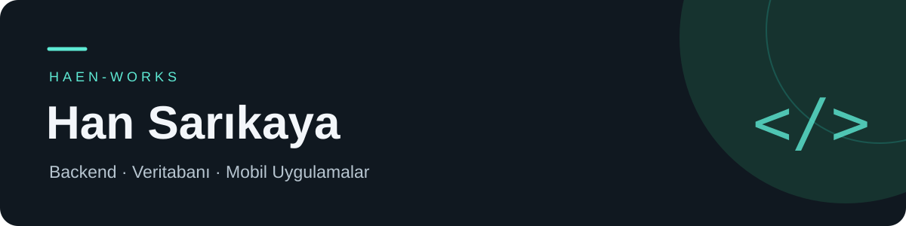

## Selam, ben Han 👋

Bilgisayar Programcılığı öğrencisiyim. **C# ve .NET ile backend geliştirme**, **ilişkisel veritabanı tasarımı** ve **mobil uygulamalar** üzerine kendimi geliştiriyorum. Öğrendiklerimi gerçek kullanım senaryolarını ele alan projelerle pratiğe döküyorum.

### Öne çıkan projeler

| Proje | Neler içeriyor? | Teknolojiler |
| :--- | :--- | :--- |
| **[FacilityFlow](https://github.com/haen-works/FacilityFlow)** | Çalışan, teknisyen ve yönetici rollerini bir araya getiren arıza takip API’si. Arıza bildirimi, teknisyen atama, durum takibi ve JWT ile kimlik doğrulama. | C# · ASP.NET Core · EF Core · SQLite |
| **[Oto Galeri Veritabanı](https://github.com/haen-works/oto-galeri-veritabani)** | Araç, müşteri, satış ve servis süreçleri için 19 tabloluk ilişkisel veritabanı. Örnek veriler, raporlama sorguları ve ER diyagramı. | SQL · MySQL · MySQL Workbench |

### Teknolojiler ve öğrenme alanlarım

**Backend & veri**  
C# · ASP.NET Core · Entity Framework Core · SQL · MySQL · SQLite

**Web & mobil**  
HTML · CSS · JavaScript · React Native · Expo

**Araçlar**  
Git · GitHub · MySQL Workbench

### Odaklandığım konular

- REST API tasarımı, kimlik doğrulama ve rol bazlı yetkilendirme
- Veritabanı ilişkileri, veri modelleme ve raporlama sorguları
- Web arayüzleri, mobil uygulamalar ve C# masaüstü uygulamaları

---

Öğreniyorum, uyguluyorum, geliştiriyorum.
